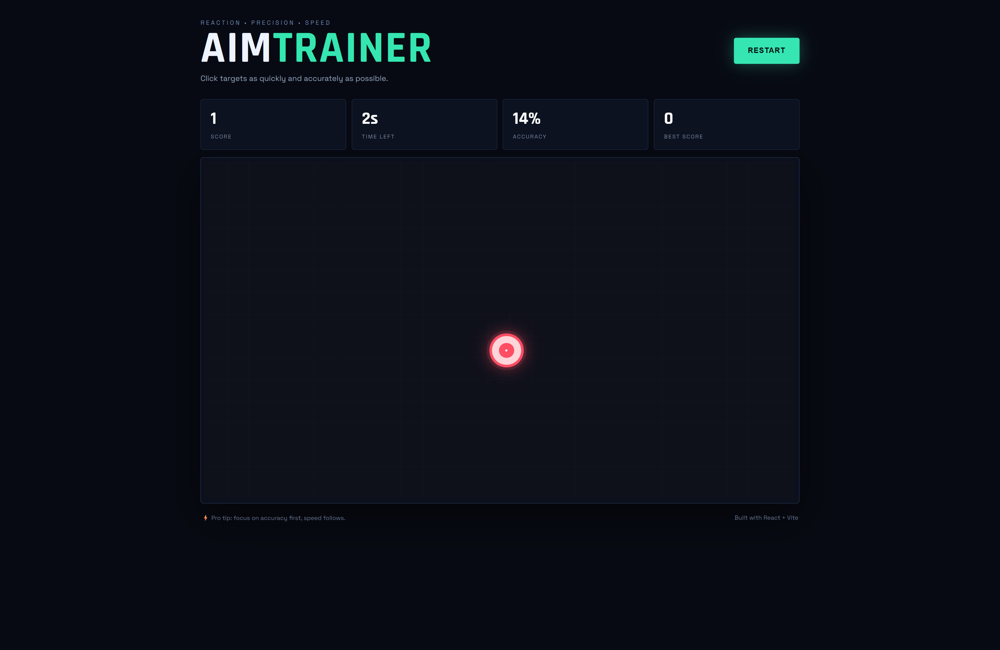

# 🎯 Aim Trainer Game

<p align="center">
  A fast-paced and interactive Aim Trainer game built with React and Vite.
</p>

<p align="center">


</p>

---

## 🎮 About The Project

**Aim Trainer** is a fun and interactive browser-based game designed to test and improve your mouse accuracy and reaction speed.

The player must quickly click on randomly appearing targets before the timer runs out. The game tracks your performance using score, accuracy, missed clicks, and best score.

---

## ✨ Features

- 🎯 Random target generation
- ⏱️ Countdown timer
- 🏆 Real-time score tracking
- 📊 Accuracy calculation
- ❌ Missed click tracking
- 💾 Best score saved using LocalStorage
- 🔄 Restart game functionality
- 📱 Fully responsive design
- ⚡ Fast development environment powered by Vite
- 🎨 Modern gaming-style user interface

---

## 🛠️ Technologies Used

| Technology | Purpose |
|-----------|---------|
| ⚛️ React.js | Building the user interface |
| ⚡ Vite | Fast development and build tool |
| 🟨 JavaScript | Game logic and functionality |
| 🎨 CSS3 | Styling and responsive design |
| 💾 LocalStorage | Saving the player's best score |

---

## 📸 Screenshots



---

## 📂 Project Structure

```text
aim-trainer/
│
├── public/
│
├── src/
│   ├── components/
│   ├── App.jsx
│   ├── main.jsx
│   └── index.css
│
├── screenshots/
│   ├── home.png
│   ├── gameplay.png
│   └── game-over.png
│
├── index.html
├── package.json
├── vite.config.js
└── README.md
```

---

## 🚀 Getting Started

Follow these steps to run the project locally.

### 1️⃣ Clone the Repository

```bash
git clone https://github.com/your-username/aim-trainer-react.git
```

### 2️⃣ Navigate to the Project Folder

```bash
cd aim-trainer-react
```

### 3️⃣ Install Dependencies

```bash
npm install
```

### 4️⃣ Start the Development Server

```bash
npm run dev
```

The application will start on a local development server.

---

## 🕹️ How to Play

1. Click the **Start Game** button.
2. Targets will appear randomly on the game area.
3. Click the targets as quickly as possible.
4. Try to achieve the highest possible score before the timer reaches zero.
5. Your accuracy and final score will be displayed at the end of the game.
6. Try again and beat your best score! 🏆

---

## 📊 Game Statistics

The game tracks the following statistics:

- 🎯 **Score** — Number of successfully clicked targets
- 📈 **Accuracy** — Percentage of successful clicks
- ❌ **Misses** — Number of unsuccessful clicks
- ⏱️ **Time Remaining** — Countdown until the game ends
- 🏆 **Best Score** — Highest score achieved by the player

---

## 💡 Future Improvements

Some features that can be added in future versions:

- 🔊 Sound effects
- 🎵 Background music
- 🔥 Difficulty levels
- 🎯 Different target sizes
- ⚡ Moving targets
- 📈 Performance analytics
- 🌐 Online leaderboard
- 👤 User authentication
- 🏆 Global rankings
- 🌙 Dark/Light mode

---

## 🤝 Contributing

Contributions are welcome!

If you would like to improve this project:

1. Fork the repository
2. Create a new branch

```bash
git checkout -b feature/YourFeature
```

3. Make your changes
4. Commit your changes

```bash
git commit -m "Add your feature"
```

5. Push to your branch

```bash
git push origin feature/YourFeature
```

6. Open a Pull Request

---

## 👨‍💻 Author

**Ajinkya Dhatrak**

GitHub: [ajinkya029](https://github.com/ajinkya029)

---

## ⭐ Show Your Support

If you like this project, please consider giving it a ⭐ on GitHub!

---

<p align="center">
  Made with ❤️ using React + Vite
</p>